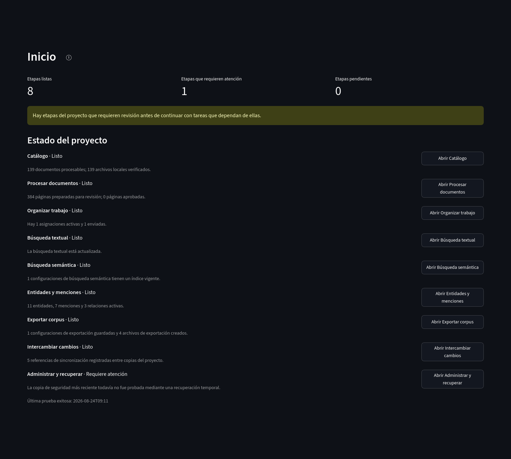
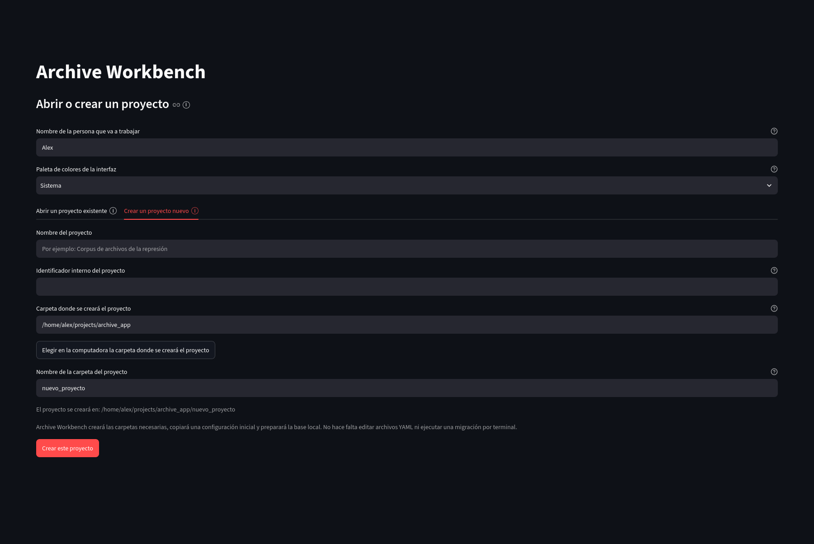
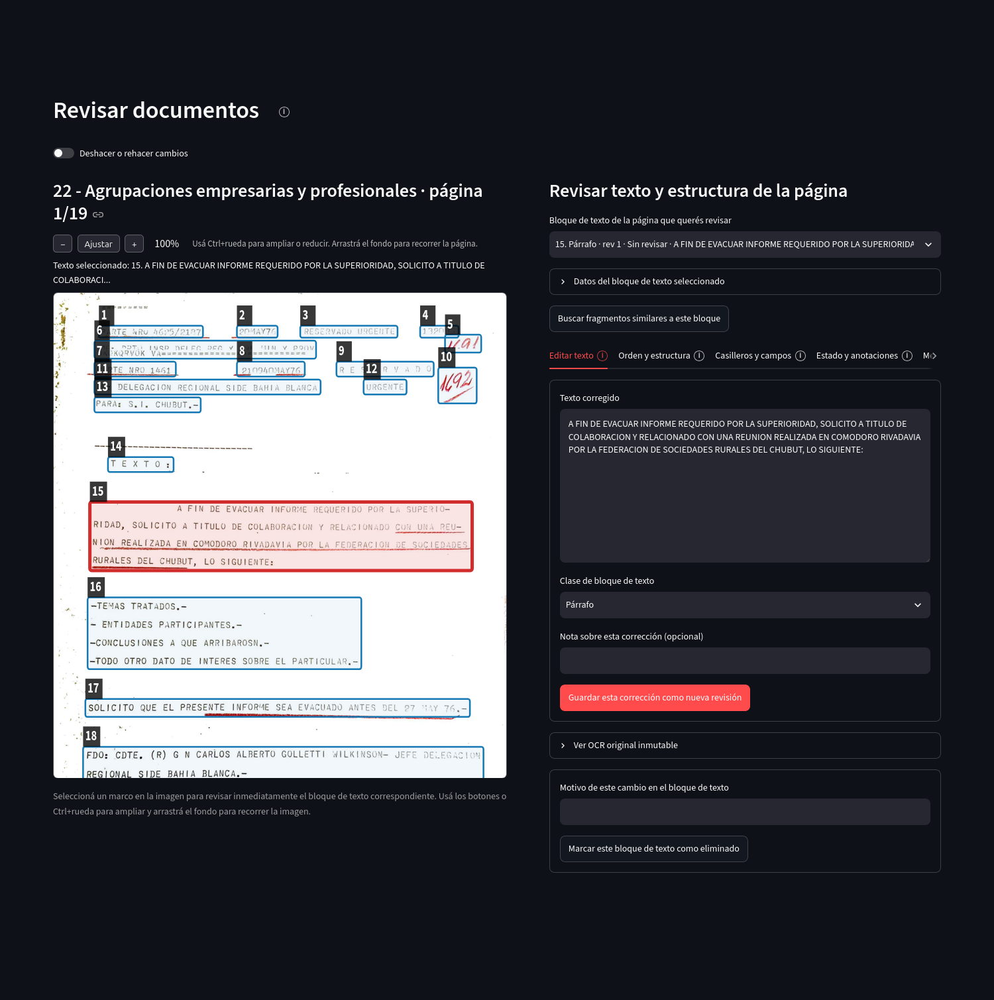
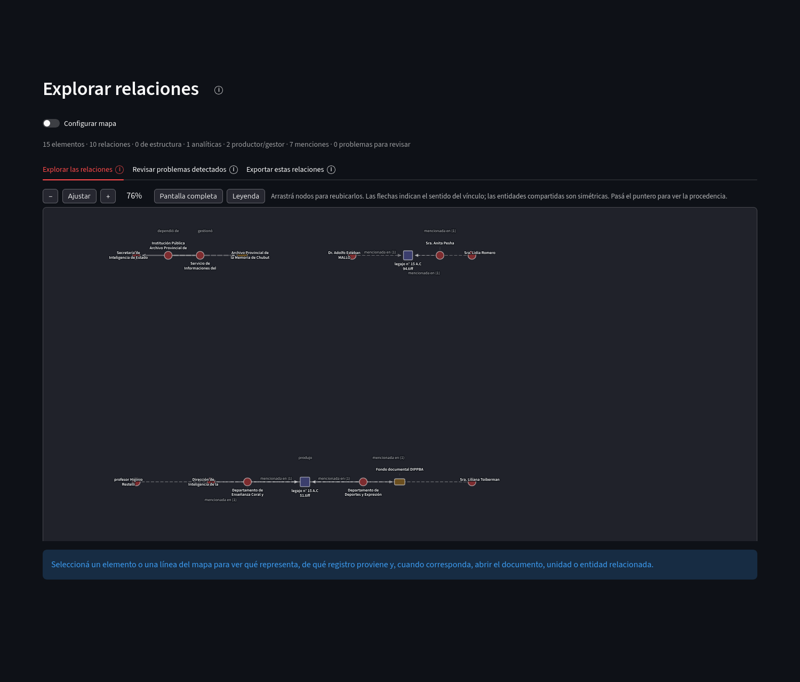

# Archive Workbench

Archive Workbench es una aplicación local para describir unidades archivísticas, incorporar documentos digitalizados, extraer y revisar texto, trabajar con audio y video, registrar entidades y relaciones, buscar en los textos y transcripciones del proyecto y preparar resultados exportables. Está orientada a archivos, bibliotecas y equipos de investigación que necesitan conservar la procedencia de los materiales y de las decisiones realizadas durante el trabajo.

Versión actual: 0.89.0, en estabilización pre-release.

[Documentación pública](docs/index.html) · [Instalación](docs/instalacion.html) · [Tutorial](docs/tutorial.html) · [Conceptos](docs/conceptos.html) · [Referencia técnica](docs/referencia.html) · [Desarrollo](docs/desarrollo.html) · [Problemas frecuentes](docs/problemas.html)

[](docs/assets/screenshots/INI-01-estado-proyecto.png)

## Capacidades principales

El recorrido de la interfaz se organiza en cinco fases visibles. En esta documentación, *corpus* significa el conjunto de documentos, textos, transcripciones y otros materiales reunidos para el trabajo del proyecto.

1. Preparación del corpus: [Catálogo](docs/catalogo.html) describe unidades y vincula archivos digitales; [Audio y video](docs/audiovisual.html) incorpora medios y administra transcripciones; [Procesar documentos](docs/procesamiento.html) prepara imágenes, ejecuta extracción de texto y permite elegir qué extracción completa pasará a revisión.
2. Organización y revisión: [Organizar trabajo](docs/trabajo.html) distribuye tareas entre personas; [Revisar documentos](docs/revision.html) muestra la imagen de una página junto al texto editable y conserva revisiones de texto, orden, estructura, formularios, anotaciones y menciones.
3. Exploración y descripción: [Búsquedas](docs/busquedas.html) reúne búsqueda textual y semántica; [Entidades y menciones](docs/entidades.html) registra referentes reutilizables del corpus; [Explorar relaciones](docs/relaciones.html) muestra las conexiones registradas en un grafo derivado.
4. Preparación de resultados: [Exportar corpus](docs/exportacion.html) crea archivos JSONL o CSV y la salida «Exportar texto e imágenes (ZIP)» con una configuración registrada y huellas de verificación.
5. Intercambio y preservación: [Intercambiar cambios](docs/intercambio.html) transporta trabajo entre copias locales del mismo proyecto mediante ZIP revisables; [Administrar y recuperar](docs/resguardo.html) comprueba integridad, crea copias de seguridad y prueba su recuperación.


La [documentación pública](docs/index.html) dedica una página a cada sección de la aplicación y utiliza capturas reales. Las capturas del sitio y del README son enlaces al PNG original para poder inspeccionar controles, tablas y recuadros de texto a resolución completa.

## Instalación rápida con Docker

La forma principal de ejecución usa una imagen preparada de Docker. No instala Python ni las dependencias internas de Archive Workbench en el sistema anfitrión.

### Windows

1. Instalá y abrí [Docker Desktop](https://docs.docker.com/desktop/).
2. Descargá o cloná este repositorio.
3. Hacé doble clic en `Start Archive Workbench - Windows.bat`.
4. Elegí un proyecto existente o abrí el inicio general.

Con una GPU NVIDIA compatible y [Docker Desktop](https://docs.docker.com/desktop/) sobre WSL2 puede utilizarse `Start Archive Workbench - GPU - Windows.bat`.

### Linux

Con [Docker Desktop](https://docs.docker.com/desktop/) o Docker Engine + Compose instalado:

```bash
./Start\ Archive\ Workbench\ -\ Linux.sh
```

Para NVIDIA GPU, con NVIDIA Container Toolkit configurado:

```bash
./Start\ Archive\ Workbench\ -\ GPU\ -\ Linux.sh
```

### macOS

Con [Docker Desktop](https://docs.docker.com/desktop/) abierto, ejecutá `Start Archive Workbench - macOS.command`. La distribución administrada de macOS utiliza la imagen CPU.

La guía de [Instalación](docs/instalacion.html) explica `ArchiveWorkbenchData`, CPU/GPU, apertura de proyectos existentes y la ruta técnica desde terminal.

## Abrir o crear un proyecto

Los lanzadores permiten elegir directamente una carpeta que ya contiene un proyecto. Si se abre el inicio general, la interfaz ofrece «Abrir un proyecto existente» y «Crear un proyecto nuevo».

[](docs/assets/screenshots/INS-02-crear-proyecto.png)

En la distribución administrada, `ArchiveWorkbenchData/` queda fuera del contenedor:

```text
ArchiveWorkbenchData/
  Projects/            proyectos administrados
  Imports/Documents/   documentos disponibles para incorporación
  Imports/AudioVideo/  audios y videos disponibles para incorporación
  Settings/            preferencias y cachés
```

Actualizar o reemplazar la imagen Docker no reemplaza esa carpeta.

## Catálogo e incorporación

El catálogo distingue la descripción archivística de la ubicación física de los archivos en la computadora. Una unidad del catálogo puede representar un fondo, una sección, una serie, una unidad documental u otro nivel habilitado por el proyecto. Los objetos digitales se vinculan con esas unidades mediante relaciones registradas.

Entre las funciones disponibles se encuentran:

- Incorporación individual y por lote de archivos digitales;
- Productores y responsables de gestión vinculados con unidades del catálogo, con período, evidencia e historial;
- importación y exportación de planillas XLSX, el formato de hoja de cálculo de Excel, con simulación previa;
- registro de ubicación, tipo e historial de cada unidad.

[Ver Catálogo](docs/catalogo.html).

## Procesamiento y revisión de documentos

La preparación de imágenes produce derivados vinculados con el archivo original. Una corrida de OCR produce una extracción de texto con su perfil y procedencia. Si hay varias extracciones disponibles para una página, «Elegir texto» determina cuál se utilizará como base en «Revisar documentos».

[](docs/assets/screenshots/REV-01-revisar-documentos.png)

Guardar una corrección crea una revisión nueva. El historial anterior permanece disponible. La misma sección permite revisar orden de lectura, columnas, casilleros y campos, etiquetas, comentarios, menciones de entidades y datos adicionales de procedencia.

[Procesar documentos](docs/procesamiento.html) · [Revisar documentos](docs/revision.html) · [Tutorial](docs/tutorial.html)

## Audio y video

Los medios pueden incorporarse desde la computadora y, con la extensión opcional correspondiente, desde una plataforma web autorizada. Las corridas de transcripción conservan el motor utilizado (backend), el modelo, el dispositivo, el idioma y las opciones. Los segmentos tienen intervalos temporales y revisiones propias; las marcas de hablante y las anotaciones temporales se conservan separadas de la corrida.

La búsqueda textual puede recuperar segmentos de transcripción y «Exportar corpus» puede producir JSONL o CSV audiovisual.

[Audio y video](docs/audiovisual.html)

## Búsquedas, entidades y relaciones

Búsqueda textual encuentra coincidencias literales en documentos revisados y transcripciones. En documentos, los resultados pueden verse como tarjetas o concordancias.

Búsqueda semántica usa un índice local de representaciones numéricas del texto, conocidas como embeddings. La similitud coseno ordena fragmentos por cercanía matemática dentro de ese índice; no es una probabilidad ni una conclusión analítica.

Entidades y menciones mantiene fichas reutilizables para personas, organizaciones, lugares, acontecimientos u otros referentes. Una mención conserva una aparición textual concreta. Las búsquedas automáticas de nuevas referencias quedan pendientes hasta que una persona las revise.

Explorar relaciones deriva un grafo a partir de entidades, unidades archivísticas, documentos, partes documentales y relaciones registradas.

[](docs/assets/screenshots/REL-01-explorar-relaciones.png)

[Búsquedas](docs/busquedas.html) · [Entidades y menciones](docs/entidades.html) · [Explorar relaciones](docs/relaciones.html)

## Exportaciones

Una exportación se define mediante una configuración que determina el alcance, la política de texto, los estados de revisión y el formato. La aplicación permite revisar los textos incluidos antes de crear el archivo y conserva un historial de las salidas generadas.

Formatos documentales:

- JSONL, un objeto JSON por línea;
- CSV, una tabla separada por comas;
- «Exportar texto e imágenes (ZIP)», que reúne texto, imágenes relacionadas y un manifiesto con procedencia y huellas.

Las transcripciones audiovisuales se exportan como JSONL o CSV por segmento.

[Exportar corpus](docs/exportacion.html)

## Intercambio y copias de seguridad

Las personas que trabajan sobre el mismo proyecto pueden usar copias locales independientes. «Intercambiar cambios» crea paquetes incrementales desde un punto compartido, inspecciona paquetes recibidos y permite resolver diferencias antes de aplicar cambios. Google Drive puede utilizarse para transportar esos ZIP; no sincroniza una base SQLite abierta.

«Preparar una copia para trabajar en equipo» crea una copia inicial transportable. La base y la configuración siempre forman parte del paquete; los originales y otros grupos de archivos se incluyen según el perfil elegido.

«Administrar y recuperar» permite comprobar la integridad del proyecto, crear copias de seguridad y probar una recuperación en un entorno temporal antes de restaurar.

[Intercambiar cambios](docs/intercambio.html) · [Administrar y recuperar](docs/resguardo.html)

## CPU y NVIDIA GPU

La imagen CPU funciona sin una placa NVIDIA y es la ruta disponible para todos los sistemas compatibles con Docker. La imagen GPU incluye las bibliotecas CUDA necesarias para las operaciones que pueden utilizar una GPU NVIDIA; el controlador pertenece al sistema anfitrión y Docker debe poder acceder al dispositivo.

Algunos componentes son opcionales. La búsqueda semántica, la incorporación desde plataformas y determinados motores de OCR o transcripción no cambian el modelo del proyecto cuando no están instalados.

## Instalación técnica desde terminal

Para desarrollo o diagnóstico puede utilizarse una instalación editable:

```bash
git clone https://github.com/alexdcolman/archive-workbench.git
cd archive-workbench
python3 -m venv .venv
source .venv/bin/activate
python -m pip install --upgrade pip
pip install -e ".[dev,extraction,streamlit,semantic,tiff,discovery,audiovisual,platform]"
archive-workbench review-app
```

La pantalla inicial ofrece «Abrir un proyecto existente» y «Crear un proyecto nuevo». También puede abrirse directamente una carpeta:

```bash
archive-workbench review-app RUTA_DEL_PROYECTO
```

Para crear o completar la estructura de un proyecto desde terminal:

```bash
archive-workbench init-project RUTA_DEL_PROYECTO
archive-workbench init-project RUTA_DEL_PROYECTO --complete-existing
```

La incorporación desde plataformas usa la extensión incluida en el conjunto completo anterior. Si se instala por separado:

```bash
pip install -e ".[platform]"
```

El trabajo con audio y video requiere FFmpeg/FFprobe en una instalación técnica que no utilice la imagen preparada de Docker.

## Principios de conservación

Cada proyecto utiliza una base de datos SQLite local y conserva sus materiales dentro de la carpeta del proyecto o mediante vínculos registrados. Las operaciones automáticas y las decisiones de revisión permanecen diferenciadas.

- Los archivos originales conservan su identidad y no se sobrescriben durante OCR o revisión.
- Derivados, corridas de extracción y transcripciones mantienen la relación con su fuente.
- Elegir qué extracción completa se revisa es una decisión explícita.
- Correcciones, fichas de entidades, menciones, relaciones y otras decisiones importantes conservan historial y procedencia.
- Los índices de búsqueda son reconstruibles y no reemplazan la base SQLite.
- Un paquete de intercambio se inspecciona antes de modificar otra copia del proyecto.
- Una copia de seguridad puede probarse sin reemplazar el proyecto activo.

La página [Conceptos](docs/conceptos.html) define el vocabulario utilizado en estas capas.

## Estado y límites

La serie 0.89.0 se encuentra en estabilización previa a 1.0. La calidad del OCR y de la transcripción depende del material, el motor de procesamiento y el perfil utilizados. Los resultados de búsqueda semántica y de detección automática de referencias requieren interpretación dentro del corpus y de su contexto documental.

El estado público del trabajo previo a 1.0 se resume en [Desarrollo](docs/desarrollo.html). Los cambios publicados se registran en [CHANGELOG.md](CHANGELOG.md).

## Desarrollo y pruebas

Instalación de desarrollo:

```bash
pip install -e ".[dev,extraction,streamlit,semantic,tiff,discovery,audiovisual,platform]"
```

La suite incluye pruebas de dominio, persistencia, interfaz, intercambio, exportación, documentación y distribución. Las instrucciones para contribuir o revisar contratos técnicos se concentran en la [Referencia técnica](docs/referencia.html) y en el código fuente.

## Licencia y cita

Archive Workbench se distribuye bajo GNU Affero General Public License v3.0 o posterior (`AGPL-3.0-or-later`).

Desarrollo: Alex Colman, en el marco del Grupo de Investigación en Archivos de la Represión (GIAR).

Cita sugerida:

> Colman, Alex, y Grupo de Investigación en Archivos de la Represión (GIAR). 2026. *Archive Workbench* (versión 0.89.0) [software]. https://github.com/alexdcolman/archive-workbench

[`CITATION.cff`](CITATION.cff) contiene los metadatos de cita para GitHub y gestores bibliográficos.
