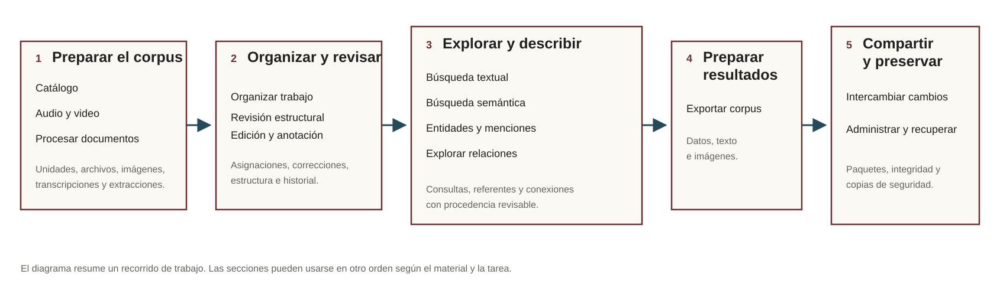

# Archive Workbench

**Archive Workbench** es una aplicación local para organizar, describir, procesar, revisar, buscar, analizar y exportar documentación archivística digitalizada. Está orientada a equipos de archivos, bibliotecas, ciencias sociales, historia, antropología, lingüística, análisis del discurso y humanidades digitales.

Los documentos y la base SQLite permanecen en la computadora del equipo. Las extracciones automáticas y las propuestas de análisis se conservan como candidatas hasta una decisión explícita.

**Versión actual:** 0.89.0, en estabilización pre-release.

[Documentación pública](docs/index.html) · [Tutorial](docs/tutorial.html) · [Instalación](docs/instalacion.html) · [Referencia técnica](docs/referencia.html) · [Desarrollo](docs/desarrollo.html) · [Problemas frecuentes](docs/problemas.html)



## Recorrido general

1. **Catálogo**: describir unidades, custodia, productores y responsables de gestión; incorporar originales sin modificarlos.
2. **Audio y video**: incorporar medios locales o autorizados desde plataformas y revisar transcripciones temporales.
3. **Procesar documentos**: preparar páginas, ejecutar OCR y comparar extracciones candidatas.
4. **Organizar trabajo**: asignar revisión primaria y cruzada cuando trabaja más de una persona.
5. **Revisar documentos**: corregir texto junto a la imagen, revisar casilleros, estructura y estados de página.
6. **Búsqueda textual** y **Búsqueda semántica**: recuperar contenido revisado por coincidencia literal o afinidad semántica.
7. **Entidades y menciones** y **Explorar relaciones**: registrar autoridades, evidencia y relaciones, y explorar un grafo derivado.
8. **Exportar corpus**: crear CSV, JSONL y paquetes de texto e imágenes con configuración y huellas.
9. **Intercambiar cambios**: compartir paquetes entre copias locales del mismo proyecto sin sincronizar una SQLite viva.
10. **Administrar y recuperar**: comprobar integridad, crear backups y ensayar recuperaciones no destructivas.

El [tutorial completo](docs/tutorial.html) explica este recorrido con los nombres visibles de la interfaz.

## Instalación rápida

Las instrucciones actuales están pensadas para Ubuntu o una distribución Linux reciente. Se necesita Python 3.11 o posterior, Tesseract OCR en español y **FFmpeg/FFprobe** para audio y video.

```bash
sudo apt update
sudo apt install -y \
  git python3 python3-venv python3-pip \
  tesseract-ocr tesseract-ocr-spa ffmpeg

git clone https://github.com/alexdcolman/archive-workbench.git
cd archive-workbench
python3 -m venv .venv
source .venv/bin/activate
python -m pip install --upgrade pip
pip install -e ".[extraction,streamlit,tiff]"
```

Abrir la aplicación:

```bash
archive-workbench review-app
```

La pantalla inicial permite **Abrir un proyecto existente** o **Crear un proyecto nuevo**. También puede abrirse directamente una carpeta conocida:

```bash
archive-workbench review-app mi_proyecto
```

Para crear la estructura desde terminal puede usarse `archive-workbench init-project mi_proyecto`. Si la carpeta ya existe y sólo se quieren completar archivos o carpetas faltantes sin reemplazar los existentes, la operación explícita es:

```bash
archive-workbench init-project mi_proyecto --complete-existing
```

La guía de [instalación y primeros pasos](docs/instalacion.html) explica extensiones opcionales para búsqueda semántica, Surya OCR e incorporación desde plataformas.

## Principios de trabajo

- Los originales conservan su identidad y no se sobrescriben durante OCR o revisión.
- Derivados, corridas y extracciones permanecen versionados y vinculados con su fuente.
- Elegir qué extracción se revisa es una decisión explícita.
- Correcciones, menciones, relaciones y otras decisiones conservan historial y procedencia.
- Los índices de búsqueda y otros artefactos reconstruibles no reemplazan la fuente canónica SQLite.
- Una propuesta automática no se convierte en una decisión archivística o analítica sin revisión.

La página de [conceptos](docs/conceptos.html) define original, derivado, corrida, candidata, selección canónica, capa editable, autoridad e índice.

## Capacidades

Archive Workbench incluye:

- **Incorporación individual y por lote** de archivos digitales, con revisión previa de sus asociaciones.
- **Productores y responsables de gestión** vinculados al catálogo con período, evidencia e historial.
- **Exportar texto e imágenes (ZIP)** con páginas, recortes y contexto estructurado.

- catálogo jerárquico configurable y plantillas XLSX con simulación previa;
- incorporación individual y por lote de PDF, TIFF, PNG, JPEG y WebP;
- preparación de imágenes y OCR versionado con Surya opcional y fallback Docling/Tesseract;
- OCR regional y propuestas revisables de estructura y orden de lectura;
- edición versionada de texto junto con la imagen;
- audio y video con transcripción segmentada y revisión sincronizada;
- autoridades, alias, menciones, relaciones y descubrimiento de referencias candidatas;
- búsqueda textual y búsqueda semántica local opcional;
- grafo derivado con capas archivísticas y analíticas diferenciadas;
- exportación CSV/JSONL y paquetes ZIP de texto e imágenes;
- asignación y revisión cruzada;
- intercambio offline entre copias y transporte opcional de paquetes por Google Drive;
- integridad, backups y pruebas de recuperación.

Las páginas temáticas de la [documentación pública](docs/index.html) explican cada capacidad sin exigir conocer la implementación.

## Extensiones opcionales

Búsqueda semántica:

```bash
pip install -e ".[semantic]"
```

Incorporación autorizada desde plataformas compatibles:

```bash
pip install -e ".[platform]"
```

Surya OCR se instala en un entorno separado para no modificar el runtime principal:

```bash
./scripts/install_surya_runtime.sh --dry-run
./scripts/install_surya_runtime.sh
```

## Límites y estado

Archive Workbench se encuentra en estabilización pre-release. El circuito completo fue probado con un corpus piloto, pero la calidad de OCR depende del material y la búsqueda semántica requiere evaluación crítica sobre cada corpus. El estado público del trabajo previo a v1.0 se resume en [Desarrollo](docs/desarrollo.html).

Las funciones automáticas no reemplazan la lectura del equipo. Una similitud semántica, una extracción OCR o una referencia candidata expresa un resultado computacional que debe interpretarse con su procedencia.

## Documentación

La documentación pública comienza en [`docs/index.html`](docs/index.html). El [tutorial](docs/tutorial.html) recorre las tareas de uso, la [referencia técnica](docs/referencia.html) reúne contratos estables y [Desarrollo](docs/desarrollo.html) explica los identificadores que aparecen en el [`CHANGELOG.md`](CHANGELOG.md).


## Desarrollo y pruebas

```bash
pip install -e ".[dev,extraction,streamlit,semantic,tiff,discovery,audiovisual,platform]"
pytest
```

La suite completa puede ser costosa. La política de pruebas del repositorio distingue gates focales, recopilación y validaciones manuales.

## Licencia y cita

Archive Workbench es software libre distribuido bajo **GNU Affero General Public License v3.0 o posterior (`AGPL-3.0-or-later`)**.

Desarrollo: **Alex Colman**, en el marco del **Grupo de Investigación en Archivos de la Represión (GIAR)**.

Cita sugerida:

> Colman, Alex, y Grupo de Investigación en Archivos de la Represión (GIAR). 2026. *Archive Workbench* (versión 0.89.0) [software]. https://github.com/alexdcolman/archive-workbench

[`CITATION.cff`](CITATION.cff) contiene los metadatos de cita para GitHub y gestores bibliográficos.
